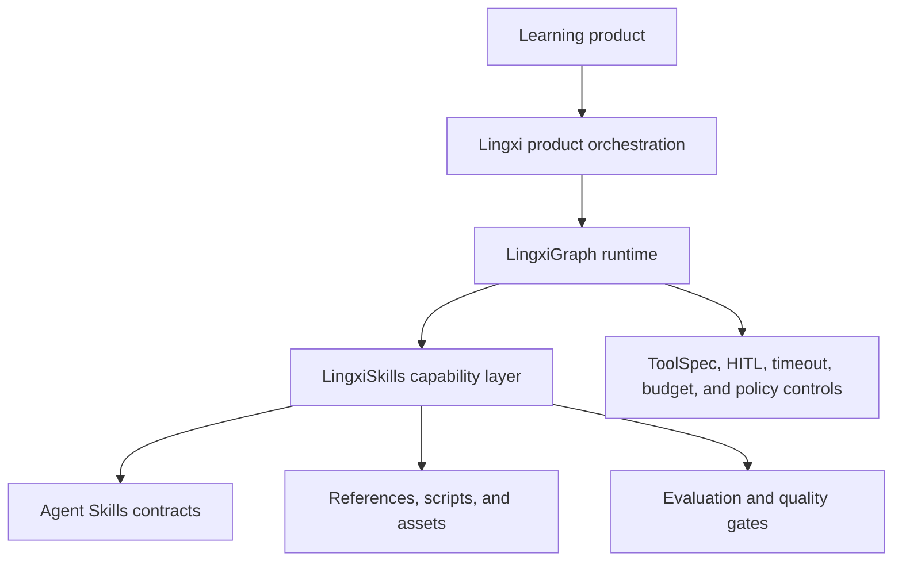

<div align="center">

# LingxiSkills

<p><strong>Composable AI learning capabilities for the LingXi technology stack.</strong><br>Turn curriculum context and learner evidence into clear, adaptive, measurable experiences.</p>

<p>
  <a href="./README.zh-CN.md">简体中文</a> · <a href="./README.md">English</a>
</p>

<p>
  <a href="#product-positioning">Product positioning</a> ·
  <a href="#quick-start-with-lingxigraph">Quick start</a> ·
  <a href="#capability-catalog">Capabilities</a>
</p>

</div>

<table>
<tr>
<td><strong>Role</strong><br>Reusable capability layer</td>
<td><strong>Runtime</strong><br>LingxiGraph and compatible runtimes</td>
<td><strong>Focus</strong><br>Personalized learning experiences</td>
<td><strong>Contract</strong><br>Agent Skills-compatible</td>
</tr>
</table>

LingxiSkills is an open collection of standards-compatible Agent Skills for turning learning intent, curriculum context, and learner evidence into dependable product experiences. It provides reusable capabilities for adaptive explanations, visual lessons, interactive lecture decks, formative assessment, retrieval practice, learner-state reflection, curriculum graphs, and deterministic evaluation.

It is not a standalone frontend, identity, billing, or content marketplace. It is the governed, composable intelligence layer that a LingXi-based product can embed behind its learner experience.

## Product positioning

LingxiSkills connects product experiences to the LingxiGraph runtime without coupling the product to a private Skill format. Each directory under `skills/` is an independently discoverable Skill with a `SKILL.md` contract and optional `scripts/`, `references/`, and `assets/` resources.

For product and engineering teams building learning experiences for large and diverse personal audiences, this gives:

- **Faster experience delivery**: assemble proven learning workflows instead of implementing every teaching interaction from scratch.
- **Consistent learner experience**: standardize language, output contracts, execution phases, and learner-facing behavior across features.
- **Controlled personalization**: use learner evidence and curriculum context while keeping state writes cautious, explicit, and reviewable.
- **Operational predictability**: declare critical paths, parallel-safe sidecars, latency classes, and evaluation suites as metadata for runtime planning.
- **Portability**: use the Agent Skills-compatible contract with LingxiGraph or another compatible runtime.

## Position in the LingXi technology stack

LingxiSkills sits between the LingxiGraph execution runtime and the application surface:



- **Experience layer**: mobile, web, or conversational surfaces used by learners, families, teachers, or administrators.
- **Product orchestration layer**: tenant, course, session, entitlement, and user-journey logic owned by the application product.
- **LingxiGraph runtime**: loads Skills, plans execution, authorizes tools, and enforces runtime policies.
- **LingxiSkills capability layer**: reusable teaching, assessment, visualization, learning-state, and evaluation capabilities.
- **Governance layer**: metadata, deterministic validators, quality gates, and evaluation suites used to keep production behavior measurable.

The key contract is a clean separation of concerns: the application owns product and learner data; LingxiGraph owns execution and policy enforcement; LingxiSkills owns reusable capability behavior and its supporting resources.

## What the product can deliver

### Learner-facing experiences

- Adaptive, evidence-based tutoring with `adaptive-pedagogy`.
- Natural Chinese lesson openings with `lesson-intro`.
- Offline interactive concept explainers with `interactive-visual-explainer`.
- Structured, zoomable HTML lecture decks with `interactive-lecture-deck`.
- Compact formative quizzes with `quiz-generator`.
- Prefetched retrieval, transfer, boundary, and misconception tasks with `retrieval-practice-builder`.

### Product intelligence and operations

- Cautious learner-state proposals with `learner-state-reflector`.
- Stable, relational curriculum graphs with `curriculum-graph-builder`.
- Conditional evidence assessment with `formative-assessor`.
- Development-time contract, trajectory, pedagogy, and learner-outcome evaluation with `skill-eval-harness`.

Together, these Skills support a product loop such as:

```text
Curriculum context + learner evidence
        → personalized response
        → assessment / retrieval sidecar
        → verified state proposal
        → next-best learning activity
```

The runtime should preserve the learner-facing critical path: `adaptive-pedagogy` is the only personalized-loop writer, while reflection, retrieval, quizzes, visual artifacts, and remedial decks can operate as non-blocking sidecars or prefetch work.

## Designed for learning products at scale

LingxiSkills is a fit for products that need personalized learning at scale while keeping capability behavior modular and reviewable:

- AI tutoring and homework support
- K–12 or adult-learning companion apps
- Exam preparation and skills-practice products
- Organizational learning products with an individual learner experience
- Family, teacher, and learner experiences sharing one curriculum graph

The repository supplies capability contracts and local validation. Product teams remain responsible for tenant isolation, identity and consent, data retention, model/provider selection, observability, deployment, billing, accessibility, and regulatory compliance.

## Quick start with LingxiGraph

Clone the repository and point LingxiGraph at the `skills/` directory:

```python
from lingxigraph import FilesystemSkillSource, HumanMessage, create_agent

skills = FilesystemSkillSource("/path/to/LingxiSkills/skills")
agent = create_agent(model, skills=skills)
result = agent.invoke({"messages": [HumanMessage("用中文问候我")]})
```

The initial model context contains only XML-escaped Skill names and descriptions. The model can explicitly call `read_skill` to load a complete `SKILL.md`, then `read_skill_resource` for a file under `references/`, `scripts/`, or `assets/`. Resource reads are bounded and traversal-safe.

Scripts are content resources only: discovering or reading a Skill never executes them. `allowed-tools` is advisory metadata and cannot grant runtime permissions or bypass LingxiGraph ToolSpec authorization, HITL approval, timeouts, budgets, or other policy controls.

## Install directly with npm

For agents that support the open Skills ecosystem, the [`skills` CLI](https://github.com/vercel-labs/skills) provides a direct npm-based installation path. It discovers the `SKILL.md` directories in this repository and links or copies them into the selected agent's Skills directory.

<details>
<summary><strong>Choose an installation scope</strong></summary>
<br>

```bash
# Install from GitHub into the current project (interactive)
npx skills add LingXi-Org/LingxiSkills

# Install one Skill into the current project
npx skills add LingXi-Org/LingxiSkills --skill adaptive-pedagogy

# Install every Skill globally for Codex, without prompts
npx skills add LingXi-Org/LingxiSkills --skill '*' --agent codex --global --yes
```

The default is project scope. Use `--global` for a user-level installation, `--agent` to target a supported agent, and `--yes` for non-interactive automation. You can also use the full repository URL:

```bash
npx skills add https://github.com/LingXi-Org/LingxiSkills
```

Node.js 18 or newer is required by the CLI. Use `npx skills list` to inspect installed Skills and `npx skills update` to refresh them.

</details>

This path is intended for agent directories managed by the CLI. For LingxiGraph, keep using the `FilesystemSkillSource` integration above so the runtime can apply its own resource, authorization, and policy controls.

## Capability catalog

| Skill | Product role |
| --- | --- |
| `adaptive-pedagogy` | Selects a low-friction teaching strategy and writes the learner-facing response. |
| `lesson-intro` | Creates a polished Chinese lesson opening from supplied curriculum context. |
| `interactive-visual-explainer` | Creates a self-contained, offline interactive HTML explanation. |
| `interactive-lecture-deck` | Builds fixed-size, self-contained HTML lecture decks with structured zoom data. |
| `formative-assessor` | Converts deterministic grading and learner signals into structured evidence. |
| `learner-state-reflector` | Proposes cautious, verifiable learner-state updates without interrupting teaching. |
| `retrieval-practice-builder` | Prefetches evidence-grounded retrieval and transfer tasks. |
| `quiz-generator` | Creates compact, evidence-grounded Chinese formative quizzes. |
| `curriculum-graph-builder` | Builds or extends learner-specific curriculum graphs with stable IDs and relations. |
| `skill-eval-harness` | Evaluates Skill contracts, trajectories, pedagogy, and learner outcomes. |

## Runtime and output conventions

- Every Skill uses an English lowercase kebab-case `name` as its runtime identity.
- Production teaching Skills expose display metadata, output language, output contract, version, author, and execution-plan fields.
- Learner-facing generated artifacts default to Simplified Chinese. Protocol keys, identifiers, formulas, code, URLs, and file names retain their technical form.
- `lesson-intro` and `interactive-lecture-deck` are preparation peers and may run in parallel.
- The personalized loop must enforce `learner_facing_writer_count <= 1`.
- State reflection, retrieval practice, visualization, quizzes, and remedial decks are non-blocking sidecars or prefetch work.

## Validate locally

The runtime remains zero-dependency. Install the optional development validator and validate each Skill:

```bash
python -m venv .venv
# Linux/macOS: source .venv/bin/activate
# Windows: .venv\\Scripts\\activate
python -m pip install -r requirements-dev.txt
python -m skills_ref.cli validate skills/interactive-visual-explainer
python -m skills_ref.cli validate skills/lesson-intro
python -m skills_ref.cli validate skills/interactive-lecture-deck
python -m skills_ref.cli validate skills/adaptive-pedagogy
python -m skills_ref.cli validate skills/learner-state-reflector
python -m skills_ref.cli validate skills/formative-assessor
python -m skills_ref.cli validate skills/retrieval-practice-builder
python -m skills_ref.cli validate skills/quiz-generator
python -m skills_ref.cli validate skills/skill-eval-harness
python -m skills_ref.cli validate skills/curriculum-graph-builder
```

Run the checked-in evaluation suites during development:

```bash
python skills/skill-eval-harness/scripts/run_suite.py .
```

## Repository structure

```text
LingxiSkills/
├── skills/
│   ├── <skill-name>/SKILL.md
│   ├── <skill-name>/references/
│   ├── <skill-name>/scripts/
│   └── <skill-name>/assets/
├── requirements-dev.txt
├── CONTRIBUTING.md
└── LICENSE
```

## Contributing

Keep `SKILL.md` concise and imperative. Put detailed, conditional material in directly linked `references/` files, deterministic helpers in `scripts/`, and output templates or other non-context assets in `assets/`. Do not add private frontmatter fields or automatic script execution behavior.

See [CONTRIBUTING.md](CONTRIBUTING.md) for validation expectations.

## Documentation approach

This README follows the information-architecture, audience-first, task-oriented, progressive-disclosure, accuracy-review, and maintenance principles described by the [technical-writer agent](https://github.com/VoltAgent/awesome-claude-code-subagents/blob/main/categories/08-business-product/technical-writer.md).
