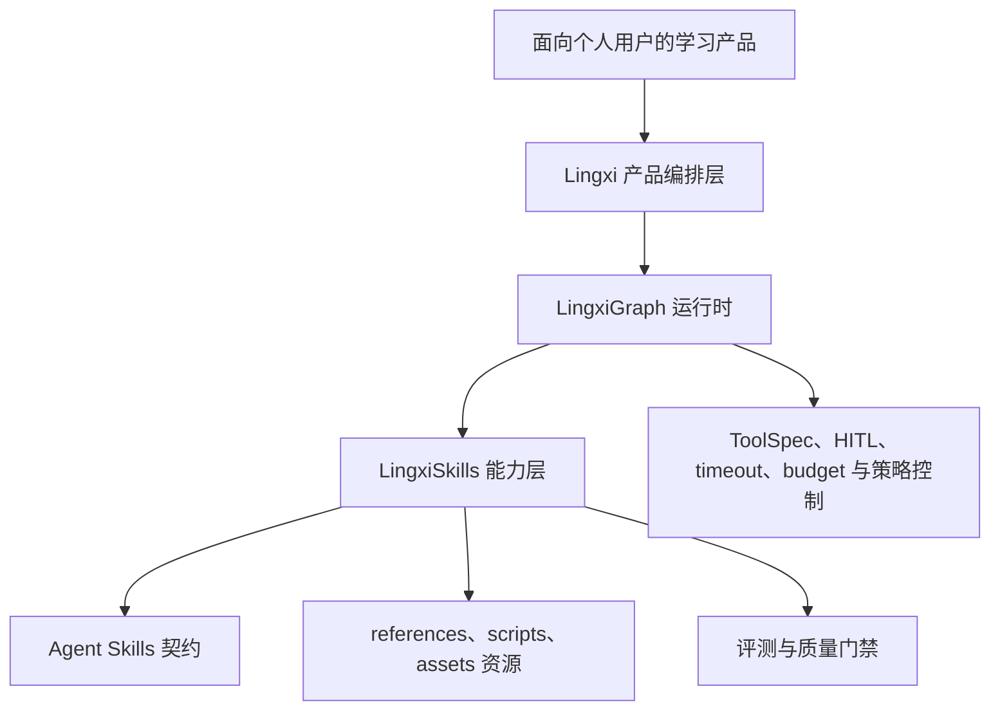

<div align="center">

# LingxiSkills

<p><strong>LingXi 技术栈中的可组合 AI 学习能力。</strong><br>将课程上下文与学习证据，转化为清晰、自适应、可度量的学习体验。</p>

<p>
  <a href="./README.zh-CN.md">简体中文</a> · <a href="./README.md">English</a>
</p>

<p>
  <a href="#产品定位">产品定位</a> ·
  <a href="#与-lingxigraph-快速集成">快速集成</a> ·
  <a href="#能力目录">能力目录</a>
</p>

</div>

<table>
<tr>
<td><strong>角色</strong><br>可复用能力层</td>
<td><strong>运行时</strong><br>LingxiGraph 及兼容运行时</td>
<td><strong>重点</strong><br>个性化学习体验</td>
<td><strong>契约</strong><br>兼容 Agent Skills 标准</td>
</tr>
</table>

LingxiSkills 是一组兼容 Agent Skills 标准的开放能力，用于把学习意图、课程上下文和学习证据转化为稳定、可组合的产品体验。它提供自适应讲解、可视化课程、交互式课件、形成性测评、检索练习、学习状态反思、课程知识图谱和确定性评测等可复用能力。

它不是独立的前端、身份认证、计费或内容交易平台，而是 LingXi 产品可以嵌入学习体验背后的、受治理且可组合的智能能力层。

## 产品定位

LingxiSkills 连接 LingxiGraph 运行时与 C 端应用体验，同时不把产品绑定到私有 Skill 格式。`skills/` 下的每个目录都是一个可独立发现的 Skill，包含 `SKILL.md` 契约，并可按需提供 `scripts/`、`references/` 和 `assets/` 资源。

对于面向大规模、差异化个人用户打造学习体验的产品与工程团队，这意味着：

- **更快交付学习体验**：复用经过契约化的教学工作流，不必为每种教学互动从零实现。
- **一致的用户体验**：统一语言、输出契约、执行阶段和 learner-facing 行为。
- **受控的个性化**：使用学习证据和课程上下文，同时让状态写入保持谨慎、显式、可复核。
- **可预测的运行行为**：通过元数据声明关键路径、可并行的 sidecar、延迟等级和评测套件，辅助运行时编排。
- **运行时可迁移**：遵循 Agent Skills 兼容契约，可用于 LingxiGraph 或其他兼容运行时。

## 在 LingXi 技术栈中的定位

LingxiSkills 位于 LingxiGraph 执行运行时与应用体验之间：



- **体验层**：学习者、家庭、教师或管理员使用的移动端、Web 或对话式产品界面。
- **产品编排层**：由应用产品负责的租户、课程、会话、权益和用户旅程逻辑。
- **LingxiGraph 运行时**：加载 Skill、编排执行、授权工具并执行运行时策略。
- **LingxiSkills 能力层**：可复用的教学、测评、可视化、学习状态和评测能力。
- **治理层**：通过元数据、确定性校验器、质量门禁和评测套件，使生产行为可度量、可维护。

核心边界是职责分离：应用负责产品数据与学习者数据；LingxiGraph 负责执行和策略约束；LingxiSkills 负责可复用的能力行为及其配套资源。

## 能为产品提供什么

### 面向学习者的体验

- 使用 `adaptive-pedagogy` 提供基于证据的自适应辅导。
- 使用 `lesson-intro` 基于已有课程上下文生成自然的中文课程开场。
- 使用 `interactive-visual-explainer` 生成可离线运行的交互式概念讲解页。
- 使用 `interactive-lecture-deck` 构建带结构化缩放数据的自包含 HTML 课件。
- 使用 `quiz-generator` 生成紧凑的形成性测评。
- 使用 `retrieval-practice-builder` 预取检索、迁移、边界和误区辨析任务。

### 产品智能与运营能力

- 使用 `learner-state-reflector` 提出谨慎的学习状态更新建议。
- 使用 `curriculum-graph-builder` 构建具有稳定 ID 和明确关系的课程图谱。
- 使用 `formative-assessor` 在需要时把判分结果和学习者信号转为结构化证据。
- 使用 `skill-eval-harness` 在开发期评测 Skill 契约、执行轨迹、教学质量和学习结果。

这些 Skill 可以共同支撑如下产品闭环：

```text
课程上下文 + 学习证据
        → 个性化回应
        → 测评 / 检索 sidecar
        → 经过验证的状态建议
        → 下一项学习活动
```

运行时应保护面向学习者的关键路径：个性化回合只允许 `adaptive-pedagogy` 作为写作者；状态反思、检索练习、测评、可视化产物和补救课件可以作为非阻塞 sidecar 或预取任务运行。

## 面向大规模学习体验设计

当产品需要面向大规模个人用户提供个性化学习，同时保持能力模块化、可复核时，LingxiSkills 适合以下场景：

- AI 家教与作业辅导
- K–12 或成人学习伴学应用
- 考试准备与技能练习产品
- 具有个人学习者体验的组织学习产品
- 共享同一课程图谱的家庭、教师和学习者体验

本仓库提供能力契约和本地校验。产品团队仍需负责租户隔离、身份与同意管理、数据留存、模型/供应商选择、可观测性、部署、计费、无障碍和监管合规。

## 与 LingxiGraph 快速集成

克隆本仓库，并将 LingxiGraph 指向 `skills/` 目录：

```python
from lingxigraph import FilesystemSkillSource, HumanMessage, create_agent

skills = FilesystemSkillSource("/path/to/LingxiSkills/skills")
agent = create_agent(model, skills=skills)
result = agent.invoke({"messages": [HumanMessage("用中文问候我")]})
```

模型初始上下文只包含 XML 转义后的 Skill 名称和描述。需要时，模型可以显式调用 `read_skill` 读取完整的 `SKILL.md`，再调用 `read_skill_resource` 读取 `references/`、`scripts/` 或 `assets/` 下的资源。资源读取有大小限制并防止路径越界。

Skill 中的脚本仅作为内容资源：发现或读取 Skill 都不会执行脚本。`allowed-tools` 只是提示性元数据，不能授予运行时权限，也不能绕过 LingxiGraph 的 ToolSpec 授权、HITL 审批、超时、预算或其他策略控制。

## 通过 npm 直接安装

对于支持开放 Skills 生态的 Agent，可以使用 [`skills` CLI](https://github.com/vercel-labs/skills) 直接安装。本仓库中的 `SKILL.md` 目录会被自动发现，并以链接或复制的方式写入所选 Agent 的 Skill 目录。

<details>
<summary><strong>选择安装范围</strong></summary>
<br>

```bash
# 从 GitHub 安装到当前项目（交互式）
npx skills add LingXi-Org/LingxiSkills

# 将单个 Skill 安装到当前项目
npx skills add LingXi-Org/LingxiSkills --skill adaptive-pedagogy

# 将全部 Skill 安装到 Codex 的用户目录，并跳过确认
npx skills add LingXi-Org/LingxiSkills --skill '*' --agent codex --global --yes
```

默认安装到当前项目。使用 `--global` 安装到用户级目录，使用 `--agent` 指定支持的 Agent，使用 `--yes` 适合无交互自动化。也可以直接使用完整仓库地址：

```bash
npx skills add https://github.com/LingXi-Org/LingxiSkills
```

该 CLI 要求 Node.js 18 或更高版本。使用 `npx skills list` 查看已安装 Skill，使用 `npx skills update` 获取更新。

</details>

这条路径适用于由 CLI 管理的 Agent 目录。对于 LingxiGraph，仍建议使用上方的 `FilesystemSkillSource` 集成方式，以便由运行时统一处理资源读取、授权和策略控制。

## 能力目录

| Skill | 产品职责 |
| --- | --- |
| `adaptive-pedagogy` | 选择低摩擦教学策略并生成面向学习者的回应。 |
| `lesson-intro` | 基于课程上下文生成自然、完整的中文课程开场。 |
| `interactive-visual-explainer` | 生成自包含、可离线运行的交互式 HTML 讲解。 |
| `interactive-lecture-deck` | 构建固定尺寸、自包含并带结构化缩放数据的 HTML 课件。 |
| `formative-assessor` | 将确定性判分和学习者信号转换为结构化证据。 |
| `learner-state-reflector` | 在不中断教学的前提下提出谨慎、可验证的学习状态更新。 |
| `retrieval-practice-builder` | 预取有证据依据的检索与迁移任务。 |
| `quiz-generator` | 生成紧凑、基于证据且可判分的中文形成性测评。 |
| `curriculum-graph-builder` | 使用稳定 ID 和关系构建或扩展个性化课程图谱。 |
| `skill-eval-harness` | 评测 Skill 契约、执行轨迹、教学质量和学习结果。 |

## 运行时与产物约定

- 每个 Skill 使用英文小写 kebab-case `name` 作为运行时标识。
- 生产教学 Skill 提供展示元数据、输出语言、输出契约、版本、作者和执行计划字段。
- 面向学习者的生成产物默认使用简体中文；协议字段、标识符、公式、代码、URL 和文件名保留原有技术形式。
- `lesson-intro` 和 `interactive-lecture-deck` 属于同一准备阶段，可以并行运行。
- 个性化回合必须强制 `learner_facing_writer_count <= 1`。
- 状态反思、检索练习、可视化、测评和补救课件属于非阻塞 sidecar 或预取任务。

## 本地校验

核心运行时保持零依赖；开发校验依赖单独安装：

```bash
python -m venv .venv
python -m pip install -r requirements-dev.txt
python -m skills_ref.cli validate skills/interactive-visual-explainer
python -m skills_ref.cli validate skills/lesson-intro
python -m skills_ref.cli validate skills/interactive-lecture-deck
python -m skills_ref.cli validate skills/adaptive-pedagogy
python -m skills_ref.cli validate skills/learner-state-reflector
python -m skills_ref.cli validate skills/formative-assessor
python -m skills_ref.cli validate skills/retrieval-practice-builder
python -m skills_ref.cli validate skills/quiz-generator
python -m skills_ref.cli validate skills/skill-eval-harness
python -m skills_ref.cli validate skills/curriculum-graph-builder
```

开发期可运行所有已提交的评测套件：

```bash
python skills/skill-eval-harness/scripts/run_suite.py .
```

## 仓库结构

```text
LingxiSkills/
├── skills/
│   ├── <skill-name>/SKILL.md
│   ├── <skill-name>/references/
│   ├── <skill-name>/scripts/
│   └── <skill-name>/assets/
├── requirements-dev.txt
├── CONTRIBUTING.md
└── LICENSE
```

## 贡献指南

保持 `SKILL.md` 简洁并使用祈使句。将详细的条件性内容放入直接链接的 `references/` 文件，将确定性辅助逻辑放入 `scripts/`，将输出模板或其他非上下文资源放入 `assets/`。不要添加私有 frontmatter 字段，也不要引入自动执行脚本的行为。

详见 [CONTRIBUTING.md](CONTRIBUTING.md) 中的校验要求。

## 文档说明

本 README 参考了 [technical-writer agent](https://github.com/VoltAgent/awesome-claude-code-subagents/blob/main/categories/08-business-product/technical-writer.md) 所强调的信息架构、受众优先、任务导向、渐进披露、准确性审查和持续维护原则。
